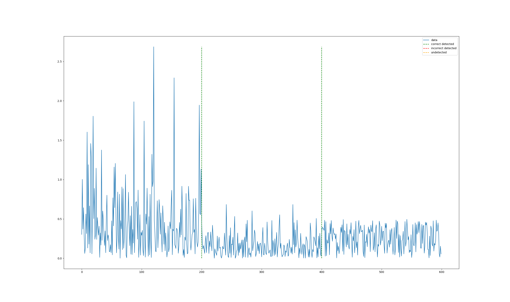

# PySATL-CPD

[status-shield]: https://img.shields.io/github/actions/workflow/status/PySATL/pysatl-cpd/.github/workflows/check.yaml?branch=main&event=push&style=for-the-badge&label=Checks
[status-url]: https://github.com/PySATL/pysatl-cpd/blob/main/.github/workflows/check.yaml
[license-shield]: https://img.shields.io/github/license/PySATL/pysatl-cpd.svg?style=for-the-badge&color=blue
[license-url]: LICENSE

[![Checks][status-shield]][status-url]
[![MIT License][license-shield]][license-url]

PySATL **Change point detection** subproject (*abbreviated pysatl-cpd*) is a module, designed for detecting anomalies in time series data, which refer to significant deviations from expected patterns or trends. Anomalies can indicate unusual events or changes in a system, making them crucial for monitoring and analysis in various fields such as finance, healthcare, and network security.

At the moment, the module implements the following CPD algorithms:
* Bayesian algorithm (scrubbing and online versions)
* Density based algorithms:
    * KLIEP
    * RuLSIF
* Graph algorithm
* k-NN based algorithm
* Algorithms, based on classifiers:
    * SVM
    * KNN
    * Decision Tree
    * Logistic Regression
    * Random Forest
---

## Requirements

- Python 3.10+
- Poetry 1.8.0+

## Installation

Clone the repository:

```bash
git clone https://github.com/PySATL/pysatl-cpd
```

Install dependencies:

```bash
poetry install
```

## Change point detection example:

```python
from pathlib import Path

from pysatl_cpd.labeled_data import LabeledCpdData

# import change point detection solver
from pysatl_cpd.online_cpd_solver import OnlineCpdSolver
from pysatl_cpd.core.problem import CpdProblem

# import algorithm
from pysatl_cpd.core.algorithms.bayesian_online_algorithm import BayesianOnline
from pysatl_cpd.core.algorithms.bayesian.likelihoods.gaussian_conjugate import GaussianConjugate
from pysatl_cpd.core.algorithms.bayesian.hazards.constant import ConstantHazard
from pysatl_cpd.core.algorithms.bayesian.detectors.threshold import ThresholdDetector
from pysatl_cpd.core.algorithms.bayesian.localizers.argmax import ArgmaxLocalizer


labeled_data = LabeledCpdData.generate_cp_datasets(Path("examples/configs/test_config_exp.yml"))["example"]

# specify CPD algorithm with parameters
algorithm = BayesianOnline(
    learning_sample_size=5,
    likelihood=GaussianConjugate(),
    hazard=ConstantHazard(rate=1.0 / (1.0 - 0.5 ** (1.0 / 500))),
    detector=ThresholdDetector(threshold=0.005),
    localizer=ArgmaxLocalizer(),
)
# make a solver object
solver = OnlineCpdSolver(CpdProblem(True), algorithm, labeled_data)


# then run algorithm
cpd_results = solver.run()

# print the results
print(cpd_results)
# output:
# Located change points: (200;400)
# Expected change point: (200;400)
# Difference: ()
# Computation time (sec): 0.2

# visualize data with located changepoints
cpd_results.visualize()
```


## Experiment pipeline example:

```python
from pathlib import Path

from new_pysatl_cpd.pipeline.pipeline import Pipeline
from new_pysatl_cpd.steps.data_generation_step.data_generation_step import DataGenerationStep
from new_pysatl_cpd.steps.data_generation_step.data_handlers.generators.cpd_generator import CpdGenerator
from new_pysatl_cpd.steps.experiment_execution_step.experiment_execution_step import ExperimentExecutionStep
from new_pysatl_cpd.steps.experiment_execution_step.workers.run_complete_algorithm_worker import (
    RunCompleteAlgorithmWorker,
)
from new_pysatl_cpd.steps.report_generation_step.report_builders.change_point_builder import CpBuilder
from new_pysatl_cpd.steps.report_generation_step.report_generation_step import ReportGenerationStep
from new_pysatl_cpd.steps.report_generation_step.report_visualizers.change_point_text_visualizer import CpTextVisualizer
from new_pysatl_cpd.steps.report_generation_step.reporters.reporter import Reporter
from pysatl_cpd.core.algorithms.bayesian.detectors.threshold import ThresholdDetector
from pysatl_cpd.core.algorithms.bayesian.hazards.constant import ConstantHazard
from pysatl_cpd.core.algorithms.bayesian.likelihoods.heuristic_gaussian_vs_exponential import (
    HeuristicGaussianVsExponential,
)
from pysatl_cpd.core.algorithms.bayesian.localizers.argmax import ArgmaxLocalizer
from pysatl_cpd.core.algorithms.bayesian_algorithm import BayesianAlgorithm

# Generate data with example config and save as my_experiment_dataset
generator = CpdGenerator(
    name="cpd_generator", output_storage_names={"example"}, config=Path("examples/configs/test_config_exp.yml")
)
step_1 = DataGenerationStep(
    data_handler=generator,
    name="cpd_generation_test_config_exp_step",
    output_storage_names={"example": "my_experiment_dataset"},
)

# Initialize BayesianAlgorithm and run with generated data
algorithm = BayesianAlgorithm(
    learning_steps=5,
    likelihood=HeuristicGaussianVsExponential(),
    hazard=ConstantHazard(rate=1.0 / (1.0 - 0.5 ** (1.0 / 500))),
    detector=ThresholdDetector(threshold=0.005),
    localizer=ArgmaxLocalizer(),
)
algo_worker = RunCompleteAlgorithmWorker(algorithm=algorithm, name="run_bayesian_algorithm_worker")
step_2 = ExperimentExecutionStep(
    worker=algo_worker, name="run_bayesian_algorithm_step", input_storage_names={"my_experiment_dataset": "dataset"}
)

# Generate text report with change points from Result Storage
builder = CpBuilder()
visualizer = CpTextVisualizer(file_name="my_experiment_change_points_report")
reporter = Reporter(builder, visualizer, name="text_reporter")
step_3 = ReportGenerationStep(reporter, name="ReportGeneration", input_storage_names={"change_points"})

# configure pipeline and start the experiment
steps = [step_1, step_2, step_3]
pipeline = Pipeline(steps)
pipeline.run()
```
output in ```results/my_experiment_change_points_report.txt```:
```txt
Located change points: [25, 201, 396]
```


## Development

Install requirements

```bash
poetry install --with dev
```

## Pre-commit

Install pre-commit hooks:

```shell
poetry run pre-commit install
```

Starting manually:

```shell
poetry run pre-commit run --all-files --color always --verbose --show-diff-on-failure
```

## License

This project is licensed under the terms of the **MIT** license. See the [LICENSE](LICENSE) for more information.
