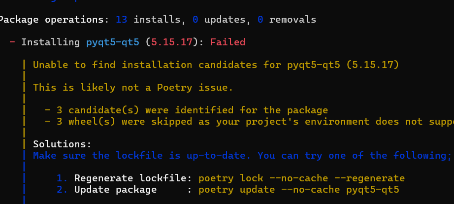

# Guide benchmarking

This guide is intended for those who plan to use the benchmarking of the pysatl-cpd project to analyze algorithms for finding change points.

## Installation

Clone repository:

```bash
git clone https://github.com/PySATL/pysatl-cpd.git
```


### Linux

Go to repository folder and run installation script:

```bash
cd pysatl-cpd
chmod +x scripts/install_user_linux.sh
./install_user_linux.sh
```


### Windows

Go to repository folder and run installation script

```shell
Set-Location pysatl-cpd
./scripts/install_user_windows.ps1
```


## Data Generation

### Available distributions

| Распределение          | Название              | Параметры                                             |
| ---------------------- | --------------------- | ----------------------------------------------------- |
| Нормальное             | `normal`              | `mean`, `variance`                                    |
| Экспоненциальное       | `exponential`         | `rate`                                                |
| Вейбулла               | `weibull`             | `shape`, `scale`                                      |
| Равномерное            | `uniform`             | `min`, `max`                                          |
| Бета                   | `beta`                | `alpha`, `beta`                                       |
| Гамма                  | `gamma`               | `alpha`, `beta`                                       |
| t-Стьюдента            | `t`                   | `n`                                                   |
| Логнормальное          | `lognorm`             | `s`                                                   |
| Многомерное нормальное | `multivariate_normal` | `mean`, в виде списка-строки, например `"[0.5, 2.0]"` |


### How to configure?

To generate a test time series, create a new configuration file inside the `pysatl_cpd/examples/configs` directory. This file defines the segments that will be concatenated in order to create the final time series.

Structure of the config file:

```yaml
- name: config_name
  distributions:
  	 - type: dist1
  	   length: length1
  	   parameters:
  	     parameter1_1: value1_1
  	     parameter1_2: value1_2
  	 - type: dist2
  	   length: length2
  	   parameters:
  	     parameter2_1: value2_1
  	     parameter2_2: value2_2
  	 # ... you can add more distribution segments here
```

**Fields**:

- `name`: A unique name for your configuration.
- `distributions`: A list of data segments to be generated. Each item in the list is a segment.
- `type`: The distribution type for the segment (e.g., normal, uniform).
- `length`: The length (number of data points) for this segment.
- `parameters`: The parameters required by the chosen distribution type (e.g., mean and variance for a normal distribution).


> Note: The available distribution types and their parameters must match the options listed in the table above. Please refer to it for a complete list of supported distributions and their required parameters.

### Config example

```yaml
- name: example
  distributions:
    - type: exponential
      length: 200
      parameters:
        rate: 2.0
    - type: beta
      length: 200
      parameters:
        alpha:  1.0
        beta:  5.0
    - type: uniform
      length: 200
      parameters:
        min: 0
        max: 0.5
```


## Algorithm configure


## Experiment run

Run example in the main directory:

```bash
poetry run python example.py
```


## Troubleshooting

### Import error: cannot import matplotlib

If you saw a similar error when running the script:



And then you get this error:


Then try installing a lower version of the package:

```bash
poetry add pyqt5-qt5==5.15.2
```
